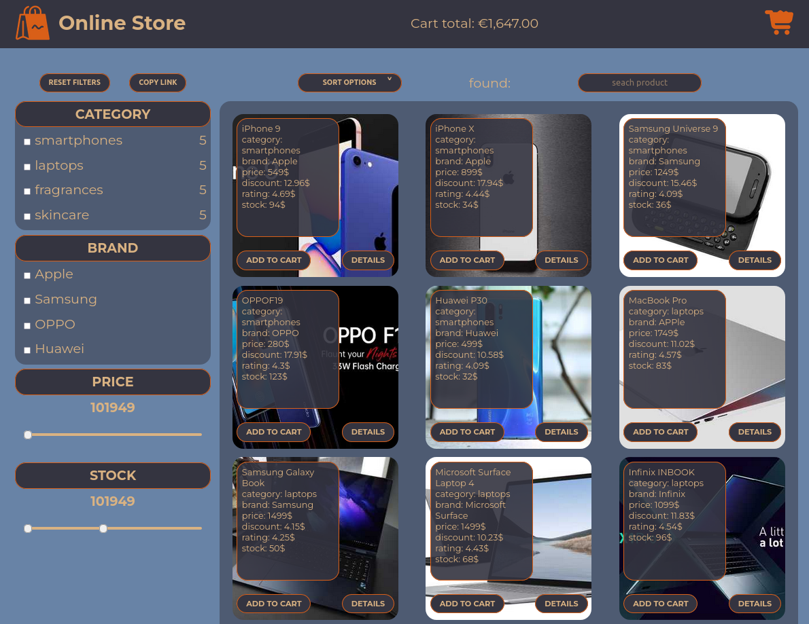

# Online-store

## ссылка на таск
https://github.com/rolling-scopes-school/tasks/tree/master/tasks/online-store-team

## как запускать из консоли

- npm install
- npm run start или npm run build

Собранный проект будет лежать в папке "dist"

## скриншот приложения

## используемые технологии

 - JavaScript
 - TypeScript
 - Sass
 - Webpack
 - EsLint
 - Modules
 - роутинг
 - фильтрация данных
 - сортировка данных

## ссылка на деплой

https://mgovoru.github.io/online-store/dist/index.html
